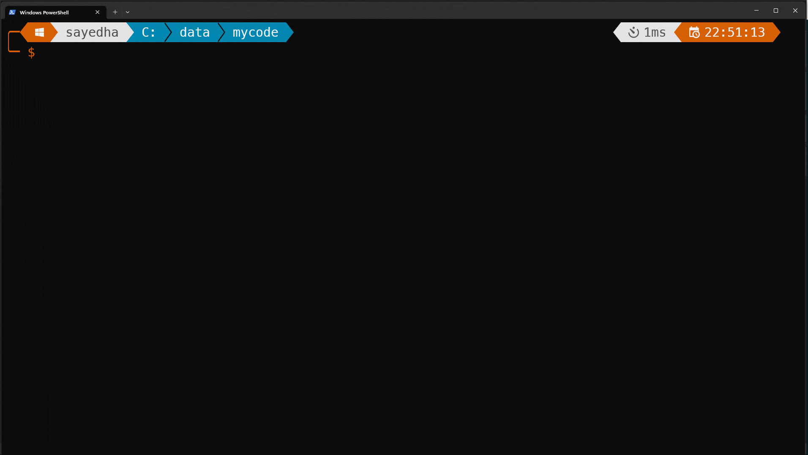
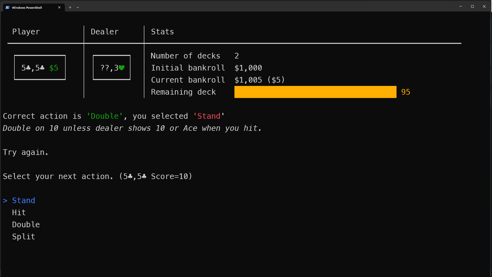

A .NET 7 command line tool to play blackjack. After installing this tool run `blackjack play` to
start the interactive game. You can enable the hint mode to provide hints as you play if you
make any errors.



dotnet CLI tool to play blackjack, more info coming soon here.

## Installation

To install this tool you must have .NET 7 installed and execute the command below.

```bash
dotnet tool install --global SayedHa.Blackjack.Cli
```

After installing this tool, get started with `blackjack play` for an interactive game.

## More info

### Hint mode

When you start a game you will be prompted to enable _hint mode_. In this mode if you select an
incorrect action based on blackjack basic strategy, you'll be notified and given a chance to correct it.

For example:


Here the player selected to ***Stand*** but the correct action was to double down.
The explanation for double down is also given as

> Double on 10 unless dealer shows 10 or Ace when you hit.

For each incorrect action there is a specific description of the rule that should be applied
to justify the correct action.

#### Session summary

When the hint mode is enabled when you are done playing a session summary will be displayed.
It will display info including basic stats for the games played.
You'll also be shown a summary of the errors played during the session, including the rule descriptions
for error actions.


## Credits

 - The interactive console UI is implemented using Spectre Console https://spectreconsole.net/.
 - The blackjack basic strategy player logic is based on the chart at https://www.blackjackapprenticeship.com/blackjack-strategy-charts/.

 ## License

 This project is using the AGPL license.

 SayedHa.Blackjack is free software: you can redistribute it and/or modify
 it under the terms of the GNU Affero General Public License as published by
 the Free Software Foundation, either version 3 of the License, or
 (at your option) any later version.
 
 SayedHa.Blackjack is distributed in the hope that it will be useful,
 but WITHOUT ANY WARRANTY; without even the implied warranty of
 MERCHANTABILITY or FITNESS FOR A PARTICULAR PURPOSE.  See the
 GNU Affero General Public License for more details.
 
 You should have received a copy of the GNU Affero General Public License
 along with SayedHa.Blackjack.  If not, see <https://www.gnu.org/licenses/>.